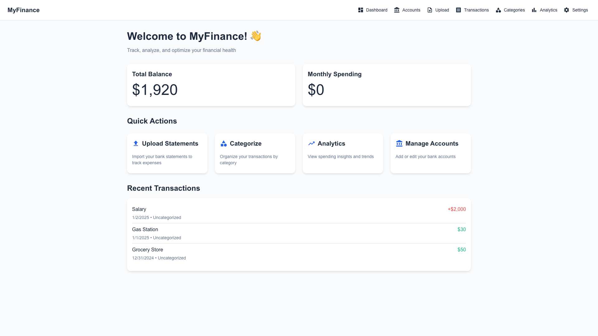
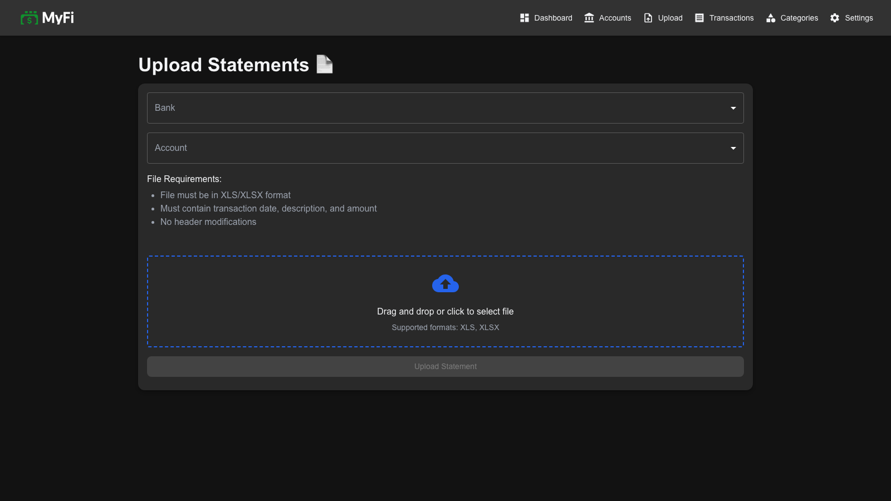
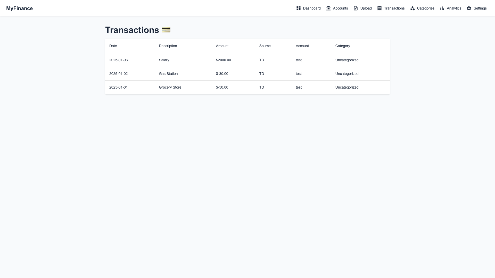
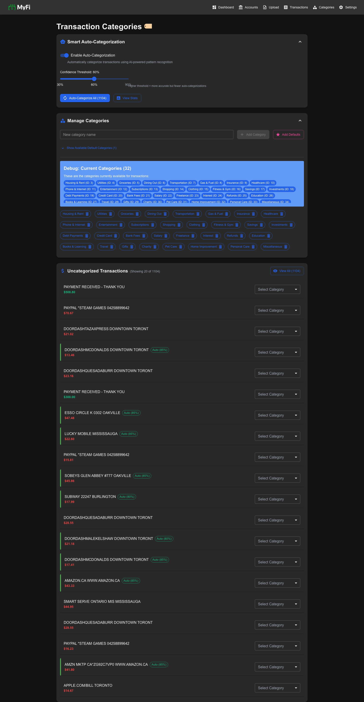
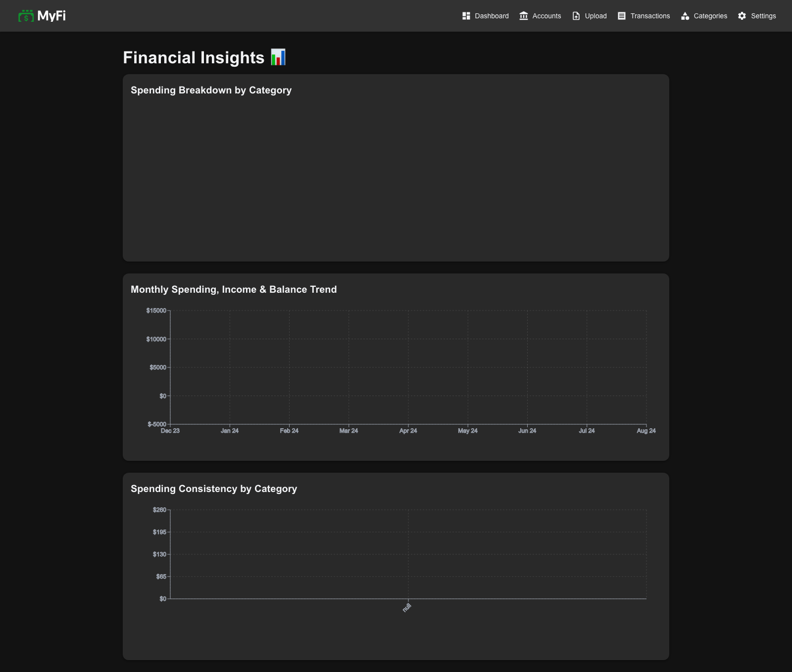
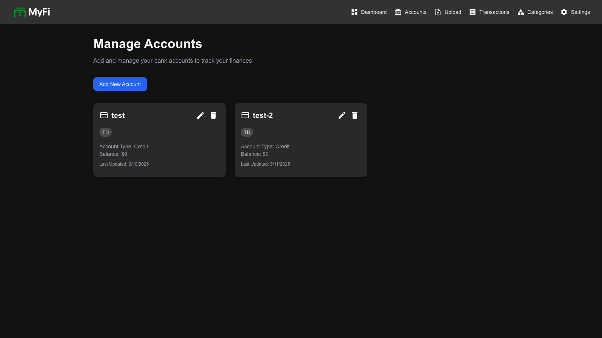
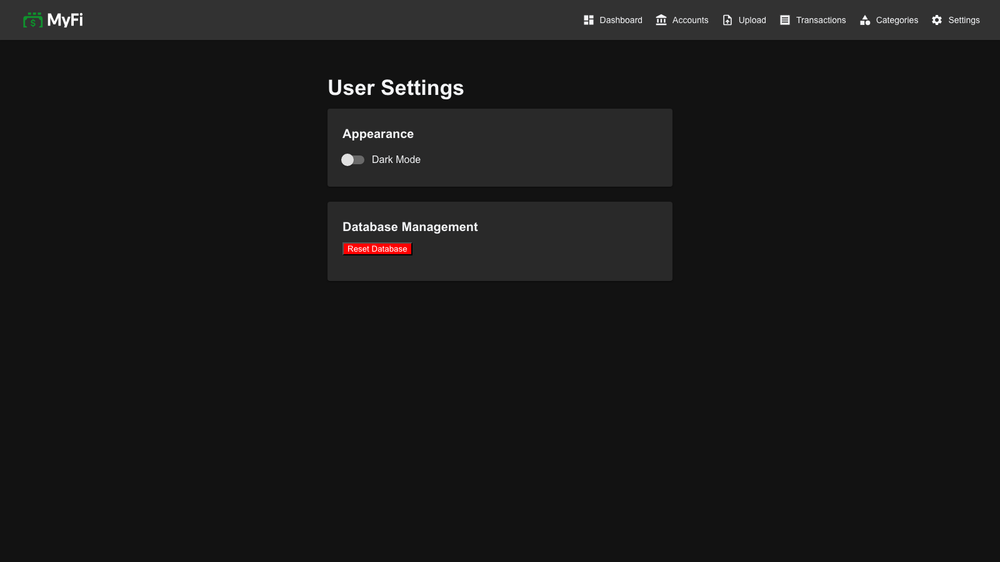

# MyFinance Dashboard

MyFinance Dashboard is a comprehensive personal finance management application built with **React** frontend and **Django** backend. This modern web application allows users to upload bank statements, categorize transactions, and generate detailed financial insights and visualizations.

## Architecture

- **Frontend**: React with Material-UI components
- **Backend**: Django REST API with SQLite database
- **Data Storage**: Local SQLite database (configurable)

---

## Features

### 🏦 **Multi-Bank Support**
- **TD Bank**: CSV statement uploads
- **American Express**: XLSX statement uploads

### 📊 **Interactive Dashboard**
- Financial overview with key metrics
- Quick action buttons for common tasks
- Real-time data visualization

### �� **File Management**
- Drag-and-drop file upload interface
- Support for CSV and XLSX formats
- Automatic transaction processing and categorization

### 🏷️ **Transaction Management**
- View all transactions in a searchable table
- Manual categorization of uncategorized transactions
- Transaction filtering and search capabilities

### 📈 **Advanced Analytics & Visualizations**
- Spending breakdown by category (pie charts)
- Monthly spending trends (line charts)
- Category variance analysis
- Interactive charts with hover details

### 🏪 **Account Management**
- Create and manage multiple bank accounts
- Account-specific transaction tracking
- Bank-specific data processing

### ⚙️ **User Settings**
- Theme customization (light/dark mode)
- Database management options
- Application preferences

---

## 📸 Screenshots

### Home Dashboard

*Main dashboard with financial overview and quick action buttons*

### File Upload

*Drag-and-drop interface for uploading bank statements (CSV/XLSX)*

### Transactions List

*Comprehensive transaction management with search and filtering capabilities*

### Categories Management

*Transaction categorization interface with bulk operations and custom categories*

### Analytics & Visualizations

*Interactive charts showing spending patterns, trends, and financial insights*

### Accounts Management

*Bank account management with support for multiple institutions*

### Settings Page

*User preferences including theme customization and database management*

---

## Installation & Setup

### Prerequisites
- Python 3.8+
- Node.js 16+
- npm or yarn

### Quick Start (Production Mode - Recommended)

The easiest way to run the web app is using the provided startup script:

```bash
# Make scripts executable (first time only)
chmod +x start.sh start-dev.sh

# Run in production mode (single server, Django serves React build)
./start.sh
```

The application will be available at `http://localhost:8000/`

### Development Mode (Two Servers)

For development with hot-reloading:

```bash
# Run development mode (Django on 8000, React on 3000)
./start-dev.sh
```

- Frontend: `http://localhost:3000`
- Backend API: `http://localhost:8000/api/`

### Manual Setup

#### Backend Setup
1. **Clone the repository**:
   ```bash
   git clone <repository-url>
   cd MyFinance
   ```

2. **Set up Python environment**:
   ```bash
   # Create virtual environment
   python3 -m venv venv
   
   # Activate virtual environment
   # On macOS/Linux:
   source venv/bin/activate
   # On Windows:
   venv\Scripts\activate
   ```

3. **Install Python dependencies**:
   ```bash
   pip install -r requirements.txt
   ```

4. **Run Django migrations**:
   ```bash
   python manage.py migrate
   ```

#### Frontend Setup
1. **Navigate to frontend directory**:
   ```bash
   cd frontend
   ```

2. **Install Node.js dependencies**:
   ```bash
   npm install
   ```

3. **Build React app for production**:
   ```bash
   npm run build
   ```

4. **Return to root and collect static files**:
   ```bash
   cd ..
   python manage.py collectstatic --noinput
   ```

5. **Start Django server** (serves both API and React app):
   ```bash
   python manage.py runserver
   ```
   The application will be available at `http://localhost:8000/`

---

## Usage

### Getting Started
1. **Start the web application** using one of the methods above
2. **Open your browser** to `http://localhost:8000` (production) or `http://localhost:3000` (development)
3. **Create your first account** in the Accounts section
4. **Upload bank statements** using the Upload page
5. **Categorize transactions** as needed
6. **View insights** in the Analytics section

### Key Workflows
- **Upload Statements**: Select bank type, choose account, upload CSV/XLSX files
- **Categorize Transactions**: Review uncategorized transactions and assign categories
- **View Analytics**: Explore spending patterns through interactive visualizations
- **Manage Accounts**: Add, edit, or remove bank accounts

---

## API Endpoints

The Django backend provides RESTful APIs for:
- `/api/upload/` - File upload processing
- `/api/transactions/` - Transaction management
- `/api/accounts/` - Account management
- `/api/categories/` - Category management
- `/api/visualizations/` - Analytics data
- `/api/dashboard/` - Dashboard metrics

---

## Development

### Building for Production
```bash
# Frontend build
cd frontend
npm run build
cd ..

# Collect static files
python manage.py collectstatic --noinput

# Start Django server (serves both API and React app)
python manage.py runserver
```

### Environment Variables (Optional)
You can configure the app using environment variables:

```bash
# Production settings
export DEBUG=False
export SECRET_KEY='your-secret-key-here'
export ALLOWED_HOSTS='yourdomain.com,www.yourdomain.com'

# Then run
python manage.py runserver
```

### Database Management
- Database is automatically initialized on first run
- Local SQLite database: `myfinance.db`
- Reset database: Use the reset option in the application

### Web App Architecture
- **Production Mode**: Django serves the built React app from a single server
- **Development Mode**: React dev server (port 3000) communicates with Django API (port 8000)
- **Static Files**: Served via WhiteNoise middleware in production
- **API Routes**: All API endpoints are under `/api/`
- **Frontend Routes**: All other routes are handled by React Router

---

## Technology Stack

- **Frontend**: React 19, Material-UI, Recharts, React Router
- **Backend**: Django 5.1, Django REST Framework
- **Database**: SQLite (local storage)
- **Charts**: Recharts library
- **Styling**: Material-UI with custom theming
