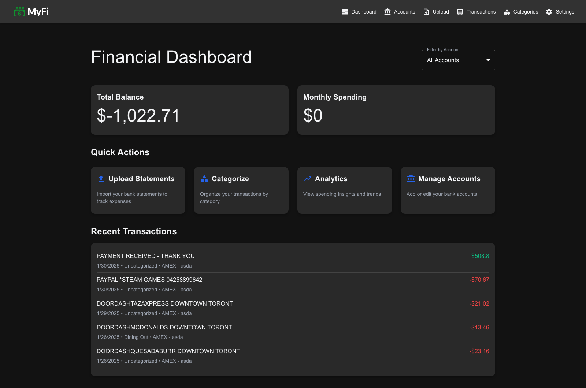
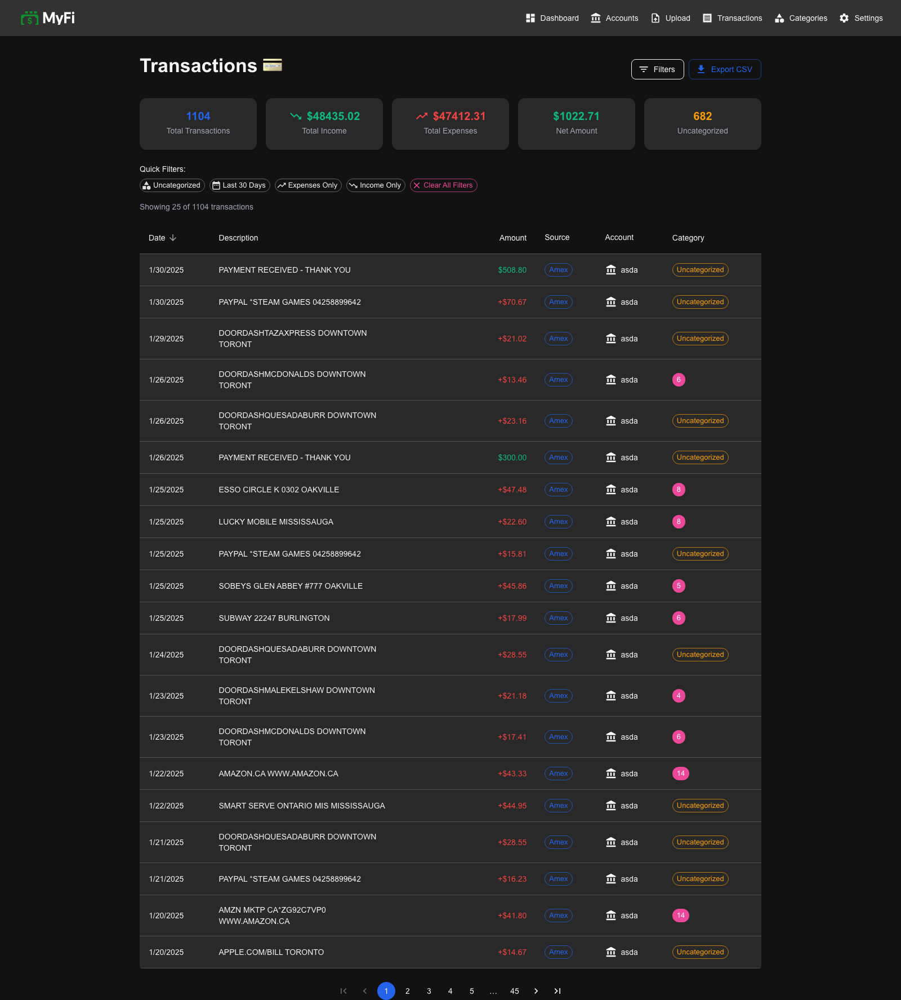
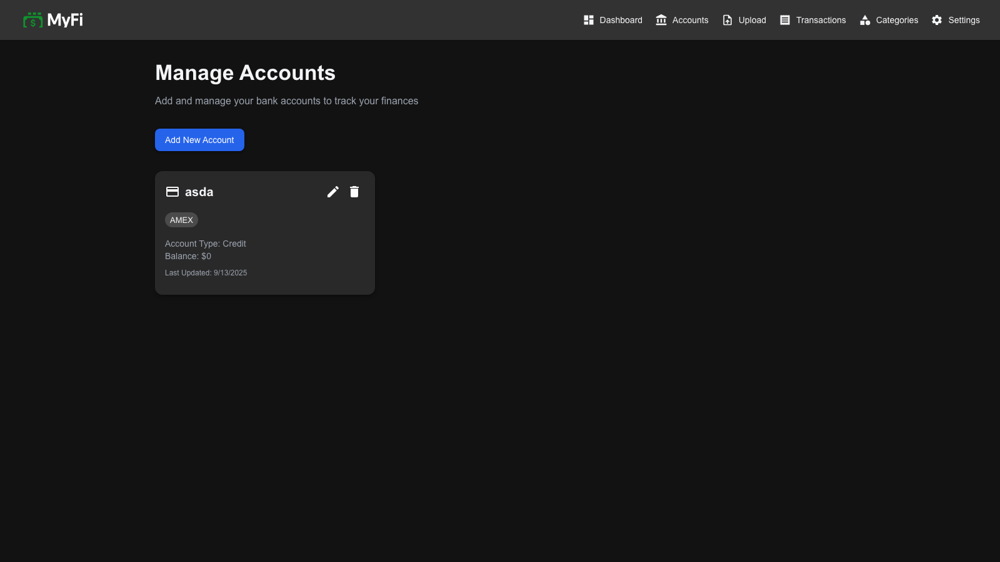

# MyFinance Dashboard

MyFinance Dashboard is a comprehensive personal finance management application built with **React** frontend and **Django** backend, packaged as a **cross-platform Electron desktop app**. This modern application allows users to upload bank statements, categorize transactions, and generate detailed financial insights and visualizations.

## Architecture

- **Frontend**: React with Material-UI components
- **Backend**: Django REST API with SQLite database
- **Desktop App**: Electron wrapper for cross-platform deployment
- **Data Storage**: Local SQLite database (configurable)

---

## Features

### 🏦 **Multi-Bank Support**
- **TD Bank**: CSV statement uploads
- **American Express**: XLSX statement uploads
- **Scotiabank**: CSV statement uploads
- **CIBC**: CSV statement uploads
- **RBC**: CSV statement uploads

### 📊 **Interactive Dashboard**
- Financial overview with key metrics
- Quick action buttons for common tasks
- Real-time data visualization

### �� **File Management**
- Drag-and-drop file upload interface
- Support for CSV and XLSX formats
- Automatic transaction processing and categorization

### 🏷️ **Transaction Management**
- View all transactions in a searchable table
- Manual categorization of uncategorized transactions
- Transaction filtering and search capabilities

### 📈 **Advanced Analytics & Visualizations**
- Spending breakdown by category (pie charts)
- Monthly spending trends (line charts)
- Category variance analysis
- Interactive charts with hover details

### 🏪 **Account Management**
- Create and manage multiple bank accounts
- Account-specific transaction tracking
- Bank-specific data processing

### ⚙️ **User Settings**
- Theme customization (light/dark mode)
- Database management options
- Application preferences
- Automated backup system

### 🖥️ **Desktop Application**
- Cross-platform Electron app (Windows, macOS, Linux)
- Native desktop integration
- Automatic backend server startup
- Offline-capable with local database

---

## 📸 Screenshots

### Home Dashboard

*Main dashboard with financial overview and quick action buttons*

### File Upload

*Drag-and-drop interface for uploading bank statements (CSV/XLSX)*

### Transactions List

*Comprehensive transaction management with search and filtering capabilities*

### Categories Management

*Transaction categorization interface with bulk operations and custom categories*

### Analytics & Visualizations

*Interactive charts showing spending patterns, trends, and financial insights*

### Accounts Management

*Bank account management with support for multiple institutions*

### Settings Page

*User preferences including theme customization and database management*

---

## Installation & Setup

### Prerequisites
- Python 3.8+
- Node.js 16+
- npm or yarn
- Electron (for desktop app)

### Backend Setup
1. **Clone the repository**:
   ```bash
   git clone <repository-url>
   cd MyFinance
   ```

2. **Set up Python environment**:
   ```bash
   # Create virtual environment
   python -m venv venv
   
   # Activate virtual environment
   # On macOS/Linux:
   source venv/bin/activate
   # On Windows:
   venv\Scripts\activate
   ```

3. **Install Python dependencies**:
   ```bash
   pip install -r requirements.txt
   ```

4. **Run Django migrations**:
   ```bash
   python manage.py migrate
   ```

5. **Start the Django backend server**:
   ```bash
   python manage.py runserver
   ```
   The API will be available at `http://127.0.0.1:8000/`

### Frontend Setup
1. **Navigate to frontend directory**:
   ```bash
   cd frontend
   ```

2. **Install Node.js dependencies**:
   ```bash
   npm install
   ```

3. **Start the React development server**:
   ```bash
   npm start
   ```
   The application will be available at `http://localhost:3000/`

### Desktop App Setup (Electron)
1. **Install Electron dependencies** (from project root):
   ```bash
   npm install
   ```

2. **Build the frontend**:
   ```bash
   npm run build-frontend
   ```

3. **Run the Electron app**:
   ```bash
   npm run electron
   ```

4. **Build for distribution**:
   ```bash
   npm run dist
   ```

---

## Usage

### Getting Started

#### Option 1: Desktop App (Recommended)
1. **Run the Electron app**:
   ```bash
   npm run electron
   ```
   The app will automatically start the backend server and open the desktop application.

#### Option 2: Web Application
1. **Launch both servers** (backend and frontend):
   ```bash
   # Terminal 1: Backend
   python manage.py runserver
   
   # Terminal 2: Frontend
   cd frontend && npm start
   ```
2. **Open your browser** to `http://localhost:3000`

### Common Workflows
1. **Create your first account** in the Accounts section
2. **Upload bank statements** using the Upload page
3. **Categorize transactions** as needed
4. **View insights** in the Analytics section

### Key Workflows
- **Upload Statements**: Select bank type, choose account, upload CSV/XLSX files
- **Categorize Transactions**: Review uncategorized transactions and assign categories
- **View Analytics**: Explore spending patterns through interactive visualizations
- **Manage Accounts**: Add, edit, or remove bank accounts

---

## API Endpoints

The Django backend provides RESTful APIs for:
- `/api/upload/` - File upload processing
- `/api/transactions/` - Transaction management
- `/api/accounts/` - Account management
- `/api/categories/` - Category management
- `/api/visualizations/` - Analytics data
- `/api/dashboard/` - Dashboard metrics

---

## Development

### Building for Production
```bash
# Frontend build
cd frontend
npm run build

# Backend (if needed)
python manage.py collectstatic
```

### Database Management
- Database is automatically initialized on first run
- Local SQLite database: `myfinance.db`
- Reset database: Use the reset option in the application

---

## Recent Updates & Fixes

### ✅ Icon Loading Issues Resolved
- Fixed bank icon loading in Electron app by updating absolute paths to relative paths
- All bank icons (TD, AMEX, Scotiabank, CIBC, RBC) now display correctly
- Logo icons in the header now load properly

### ✅ Dashboard Navigation Fixed
- Electron app now properly navigates to dashboard on launch
- Backend server automatically starts when running the desktop app
- Improved error handling and startup process

### ✅ Enhanced Bank Support
- Added support for additional Canadian banks (CIBC, RBC)
- Improved bank icon integration across all pages
- Better error handling for unsupported file formats

---

## Technology Stack

- **Frontend**: React 19, Material-UI, Recharts, React Router
- **Backend**: Django 5.1, Django REST Framework
- **Desktop App**: Electron 32+ with automatic backend integration
- **Database**: SQLite (local storage)
- **Charts**: Recharts library
- **Styling**: Material-UI with custom theming

---

## Troubleshooting

### Common Issues

#### Electron App Won't Start
- **Issue**: "app object is undefined" error
- **Solution**: Reinstall Electron dependencies:
  ```bash
  npm install electron@latest
  ```

#### Icons Not Loading
- **Issue**: Bank icons or logo not displaying
- **Solution**: Ensure you're using the latest version with relative path fixes

#### Backend Connection Issues
- **Issue**: Dashboard shows loading errors
- **Solution**: The Electron app automatically starts the backend. If issues persist:
  ```bash
  # Manual backend start
  python manage.py runserver
  ```

#### Build Issues
- **Issue**: Frontend build fails
- **Solution**: Clear cache and rebuild:
  ```bash
  cd frontend
  rm -rf node_modules package-lock.json
  npm install
  npm run build
  ```

### Getting Help
- Check the console output for detailed error messages
- Ensure all dependencies are properly installed
- Verify Python and Node.js versions meet requirements
